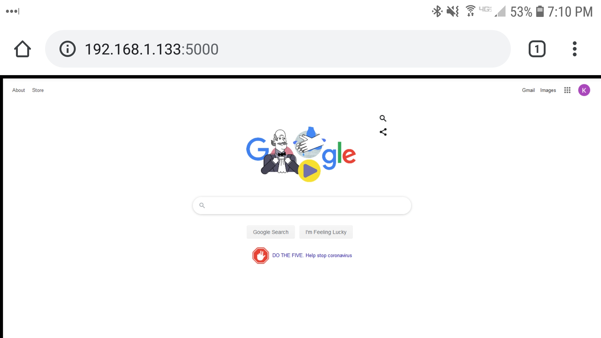
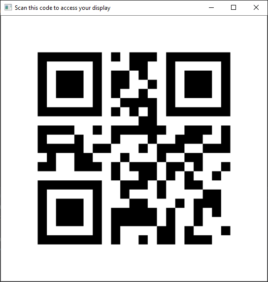

# FreeDisplay



FreeDisplay is a free application for mirroring your display to everyone on your local network (like your home WiFi). People can access a mirror of your screen through their web browser by scanning a QR code that is generated when you start the program, or by typing in the address that is generated in the window when you start mirroring. As long as they share a network with you, they'll see your screen in their web browser of choice for as long as you choose to share!



# Installation

[Download the Windows executable here](https://github.com/kevinl95/freedisplay/releases/download/1.0/freedisplay.zip)

Unzip the zip file anywhere on your machine. Double-click FreeDisplay.exe and mirroring will begin immediately.

# Development

This is an open-source project written in Python 3. You can install the prerequisite packages like so:

```
pipenv install
```

## Building an executable with cx_Freeze

```
python setup.py build
```
