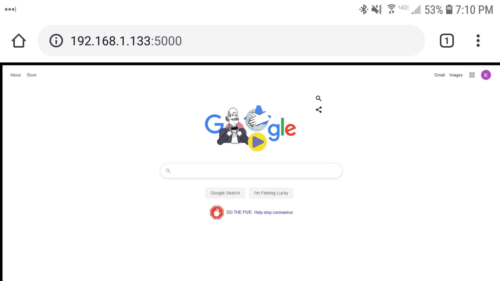
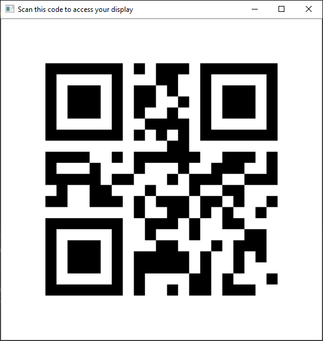

FreeDisplay is a free application for mirroring your display to everyone on your local network. People can access a mirror of your screen through their web browser by scanning a QR code that is generated when you start the program, or by typing in the address that is generated in the window when you start mirroring.

# Installation

[Download the Windows executable here](https://github.com/kevinl95/freedisplay/releases/download/1.0/freedisplay.zip)

Unzip the zip file anywhere on your machine. Double-click FreeDisplay.exe and mirroring will begin immediately.
